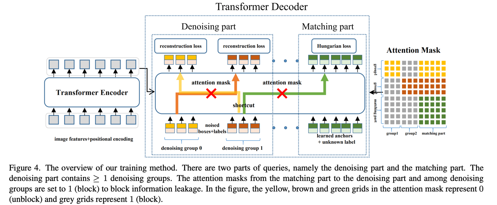
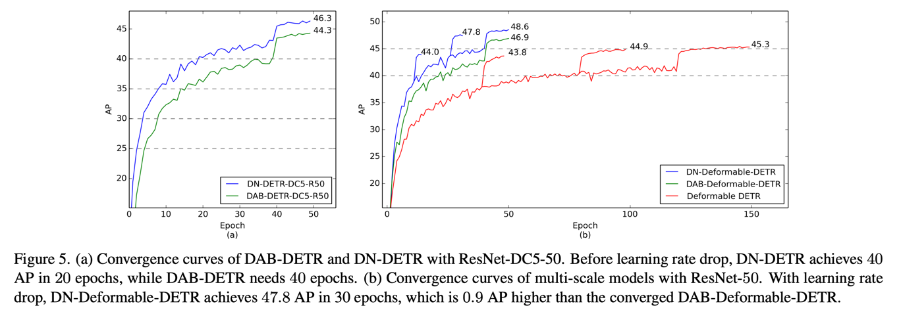

**DN-DETR**: Accelerate DETR Training by Introducing Query DeNoising
========

By [Feng Li*](https://fengli-ust.github.io/), [Hao Zhang*](https://haozhang534.github.io/), [Shilong Liu](https://scholar.google.com/citations?hl=zh-CN&user=nkSVY3MAAAAJ), [Jian Guo](https://idea.edu.cn/en/about-team/jian_guo.html), [Lionel M.Ni](https://scholar.google.com/citations?hl=zh-CN&user=OzMYwDIAAAAJ), and [Lei Zhang](https://scholar.google.com/citations?hl=zh-CN&user=fIlGZToAAAAJ).

This repository is an official implementation of the [DN-DETR](https://arxiv.org/pdf/2203.01305.pdf). Accepted to **CVPR 2022** (score **112**, **Oral** presentation). Code is avaliable now.
[[CVPR paper link](https://openaccess.thecvf.com/content/CVPR2022/papers/Li_DN-DETR_Accelerate_DETR_Training_by_Introducing_Query_DeNoising_CVPR_2022_paper.pdf)] [[extended version paper link](https://arxiv.org/pdf/2203.01305.pdf)] [[中文解读](https://www.zhihu.com/question/517340666/answer/2381304399)]


## Introduction
本文提出了一种新的去噪训练方法 DN-DETR，旨在加速 DETR（DEtection TRansformer）的训练过程。研究者发现 DETR 训练收敛慢的问题源于二分图匹配的不稳定性，这在训练的早期阶段尤为明显。为了解决这个问题，DN-DETR 在 DETR 的基础上引入了去噪任务，通过在 Transformer 解码器中添加带有噪声的真实边界框（GT bounding boxes），训练模型重建原始框。这种方法有效地降低了二分图匹配的难度，从而加快了收敛速度。DN-DETR 的方法是通用的，可以通过添加少量代码轻松集成到任何DETR-like方法中。实验结果表明，DN-DETR 在相同的设置下实现了显著的性能提升，并且在较短的训练周期内达到了与基线相当的性能。


## Method
本文提出了一种新的训练方法，在 DAB-DETR 的基础上添加了去噪部分来加速训练收敛。它仅增加最少的计算，并将在推理期间被删除。
方法通过引入查询去噪任务来帮助稳定训练过程中的二部图匹配。具体实现为将带噪的 ground truth（GT）边界框作为带噪查询与可学习的锚查询一起
输入到 Transformer 解码器。这两种查询具有相同的 ( x , y , w , h ) 输入格式，可以同时输入到 Transformer 解码器中。对于带噪查询，通过执行一个去噪任务来重建它们对应的 GT boxes。对于其他可学习的锚查询，使用与 vanilla DETR 中相同的训练损失，包括二分匹配。由于带噪边界框不需要经过二分图匹配组件，因此去噪任务可以被视为一个更简单的辅助任务，帮助 DETR 缓解不稳定的离散二分图匹配，降低了二分图匹配的难度，并更快速地学习边界框预测，从而加速了训练过程的收敛。



实验部分进行了大量的实验来验证我们的去噪训练的有效性，例如收敛曲线比较。



## Model

#### 50 epoch setting
<table>
  <thead>
    <tr style="text-align: right;">
      <th></th>
      <th>name</th>
      <th>backbone</th>
      <th>box AP</th>
      <th>Log/Config/Checkpoint</th>

  </thead>
  <tbody>
    <tr>
      <th>0</th>
      <td>DN-DETR-R50</td>
      <td>R50</td>
      <td>44.4<sup><a id="sup3c" herf="#sup1">1</a></sup></td>
      <td><a href="https://drive.google.com/drive/folders/1kuwScU8PhN61qQOl5bbiPhKAYbzDHsWs?usp=sharing">Google Drive</a>&nbsp/&nbsp<a href="https://pan.baidu.com/s/1TqvnjsbAjARZp1i8cB2w8A?pwd=niet">BaiDu</a>&nbsp</td>
      <td>Table 1</td>
    </tr>
    <tr>
      <th>2</th>
      <td>DN-DETR-R50-DC5</td>
      <td>R50</td>
      <td>46.3</td>
      <td><a href="https://drive.google.com/drive/folders/1jr8BdDdMu8esABXdU3lNY7fpWVxAJtWa?usp=sharing">Google Drive</a>&nbsp/&nbsp<a href="https://pan.baidu.com/s/1lWrLUkxNfrncRTM-zmpbeA?pwd=niet">BaiDu</a>&nbsp;</td>
      <td>Table 1</td>
    </tr>
    <tr>
      <th>5</th>
      <td>DN-DAB-Deformbale-DETR<br>(Deformbale Encoder Only)<sup><a id="sup3c" herf="#sup3">3</a></sup></td>
      <td>R50</td>
      <td>48.6</td>
      <td><a href="https://drive.google.com/drive/folders/1TLIuvMw6F9lBv77gWQ3Qcn5tdfG7kqdU?usp=sharing">Google Drive</a>&nbsp/&nbsp<a href="https://pan.baidu.com/s/1emOumSadTJbCcoqxhKnllQ?pwd=niet">BaiDu</a>&nbsp</td>
      <td>Table 3</td>
    </tr>
    <tr>
      <th>6</th>
      <td>DN-DAB-Deformable-DETR-R50-v2<sup><a id="sup4c" herf="#sup4">4</a></sup></td>
      <td>R50</td>
      <td>49.5 (48.4 in 24 epochs)</td>
      <td><a href="https://drive.google.com/drive/folders/1pIllR0VfSIqX8TmQy0PFNiPdp87j-78j?usp=sharing">Google Drive</a>&nbsp/&nbsp<a href="https://pan.baidu.com/s/1ugoXlpr3x72qcXPKQ669sA?pwd=niet">BaiDu</a>&nbsp</td>
      <td>Optimized implementation with deformable attention in both encoder and decoder. See <a href="https://github.com/IDEA-opensource/DAB-DETR">DAB-DETR</a> for more details.</td>
    </tr>
  </tbody>
</table>


# Installation


环境配置 ```python=3.7.3,pytorch=1.9.0,cuda=11.1```. 

安装pytorch和torchvision：https://pytorch.org/get-started/locally/.

安装配置实验所需的库：

```sh
pip install -r requirements.txt
```
编译CUDA运算符
```sh
cd models/dn_dab_deformable_detr/ops
python setup.py build install
# unit test (should see all checking is True)
python test.py
cd ../../..
```

## Data

下载[COCO 2017](https://cocodataset.org/) 数据集并按如下方式组织：
```
COCODIR/
  ├── train2017/
  ├── val2017/
  └── annotations/
  	├── instances_train2017.json
  	└── instances_val2017.json
```


## Training
使用标准DN-DETR-R50和DN-Deformable-DETR-R50作为示例进行训练和评估。预训练模型下载：

[DN-DETR-R50模型](https://drive.google.com/drive/folders/1kuwScU8PhN61qQOl5bbiPhKAYbzDHsWs?usp=sharing)

[DN-DAB-Deformable-DETR模型](https://drive.google.com/drive/folders/1pIllR0VfSIqX8TmQy0PFNiPdp87j-78j?usp=sharing)

[DN-DAB-Deformable-DETR_Deformable_Encoder_Only](https://drive.google.com/drive/folders/1TLIuvMw6F9lBv77gWQ3Qcn5tdfG7kqdU?usp=sharing)

命令如下：
```sh
# for dn_detr: 
python main.py -m dn_dab_detr \
  --output_dir logs/dn_DABDETR/R50 \
  --batch_size 1 \
  --coco_path /path/to/your/COCODIR \ # replace the args to your COCO path
  --resume /path/to/our/checkpoint \ # replace the args to your checkpoint path
  --use_dn \
  --eval

# for dn_deformable_detr
python main.py -m dn_deformable_detr \
  --output_dir logs/dab_deformable_detr/R50 \
  --batch_size 1 \
  --coco_path /path/to/your/COCODIR \ # replace the args to your COCO path
  --resume /path/to/our/checkpoint \ # replace the args to your checkpoint path
  --transformer_activation relu \
  --use_dn \
  --eval
  
# for dn_deformable_detr_deformable_encoder_only: 
python main.py -m dn_dab_deformable_detr_deformable_encoder_only 
  --output_dir logs/dab_deformable_detr/R50 \
  --batch_size 1 \
  --coco_path /path/to/your/COCODIR \ # replace the args to your COCO path
  --resume /path/to/our/checkpoint \ # replace the args to your checkpoint path
  --transformer_activation relu \
  --num_patterns 3 \  # use 3 pattern embeddings
  --use_dn  \
  --eval

# for dn_detr（训练自己的模型）
python main.py -m dn_dab_detr \
  --output_dir logs/dn_DABDETR/R50 \
  --batch_size 1 \
  --epochs 50 \
  --lr_drop 40 \
  --coco_path /path/to/your/COCODIR  # replace the args to your COCO path
  --use_dn
```


### Distributed Run
由于训练非常耗时，可以在多设备上训练模型。
以下是使用 Slurm 在集群上训练模型的训练命令示例：
```sh
# for dn_detr:
python run_with_submitit.py \
  --timeout 3000 \
  --job_name DNDETR \
  --coco_path /path/to/your/COCODIR \
  -m dn_dab_detr \
  --job_dir logs/dn_DABDETR/R50_%j \
  --batch_size 2 \
  --ngpus 8 \
  --nodes 1 \
  --epochs 50 \
  --lr_drop 40 \
  --use_dn

# for dn_dab_deformable_detr: 
python run_with_submitit.py \
  --timeout 3000 \
  --job_name dn_dab_deformable_detr \
  --coco_path /path/to/your/COCODIR \
  -m dab_deformable_detr \
  --transformer_activation relu \
  --job_dir logs/dn_dab_deformable_detr/R50_%j \
  --batch_size 2 \
  --ngpus 8 \
  --nodes 1 \
  --epochs 50 \
  --lr_drop 40 \
  --use_dn

# for dn_dab_deformable_detr_deformable_encoder_only: 
python run_with_submitit.py \
  --timeout 3000 \
  --job_name dn_dab_deformable_detr_deformable_encoder_only \
  --coco_path /path/to/your/COCODIR \
  -m dn_dab_deformable_detr_deformable_encoder_only \
  --transformer_activation relu \
  --job_dir logs/dn_dab_deformable_detr/R50_%j \
  --num_patterns 3 \ 
  --batch_size 1 \
  --ngpus 8 \
  --nodes 2 \
  --epochs 50 \
  --lr_drop 40 \
  --use_dn
```
